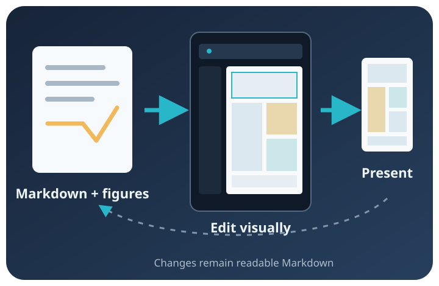
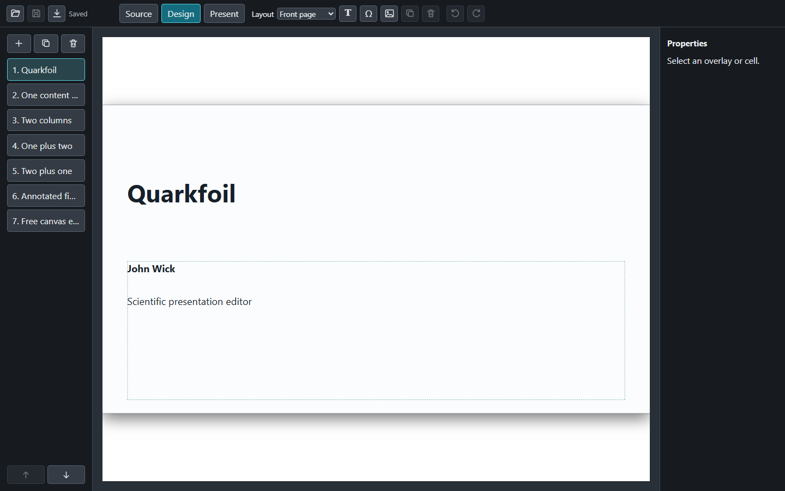

---
hide:
  - navigation
  - toc
---

# Scientific slides, without surrendering the canvas

Quarkfoil combines readable Markdown and LaTeX with the direct manipulation of
a slide editor. Build structured layouts quickly, then place and tune the
objects that need individual attention.

[Get started](QUICK_START.md){ .md-button .md-button--primary }
[Explore the editor](USER_GUIDE.md){ .md-button }

### Structured when useful

Choose one-, two-, or three-region layouts, opening pages, title-only slides,
or a completely free canvas.

### Precise when needed

Move and resize text, equations, and images visually. Adjust crop, focus,
alignment, layer order, and relative type size from the properties panel.

### Portable by design

The presentation remains a Markdown file plus its figures. Quarkfoil runs
locally, vendors its browser libraries, and needs neither Node nor a cloud
account.

## One source, three views

{ .qf-editor-shot }

Source, Design, and Present all operate on the same document. Simple slides can
be written directly; graphical changes are serialized back into readable
Markdown annotations.

!!! tip "Start with the example"
    The repository includes a presentation demonstrating every layout, image
    behavior, equation overlays, and annotations. Open it with
    `uv run quarkfoil example/deck.md` from a source checkout.

## A deliberately small toolchain

Quarkfoil uses a Python standard-library server and pinned local copies of
Reveal.js, KaTeX, Marked, and js-yaml. Presentation editing never depends on a
runtime CDN. Read the [security model](SECURITY.md) and the complete
[licensing inventory](LICENSES.md).
