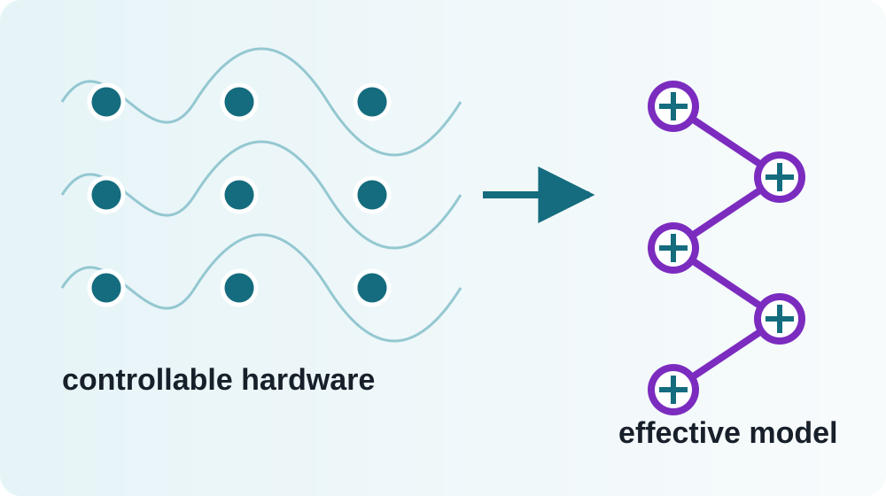

# Scientific Slides {.title-slide .layout-front}

::: core
**John Wick**

Scientific Slides Demonstration
:::

---

## One content region {.layout-1}

::: core
### The simple case remains simple

This slide uses one Markdown region. Equations are written as LaTeX:

\[
H_{\mathrm{BH}}=-t\sum_{\langle i,j\rangle}
  (a_i^\dagger a_j+\mathrm{h.c.})
  +\frac{U}{2}\sum_i n_i(n_i-1).
\]

No visual editor is required to author or revise it.
:::

---

## Two columns {.layout-1-1 columns="42 58"}

::: left
### Hardware controls

- lattice depth → tunnelling;
- scattering length → interaction;
- local potential → chemical potential;
- imaging → occupation snapshots.
:::

::: right
{fit=contain focus="50 50"}
:::

::: overlay {#exchange-label type="equation" x="58" y="64" w="30" h="10" z="12" fragment="1"}
\[
J_{\mathrm{ex}}\sim\frac{t^2}{U}
\]
:::

---

## One plus two {.layout-1-2 columns="44 56" rows="54 46"}

::: left
### Resizable regions

Drag the cyan dividers in Design mode. The resulting ratios are saved into this heading.

Double-click a Markdown cell or a movable equation to edit it.
:::

::: top-right
{fit=cover focus="62 45"}
:::

::: bottom-right
### Image fitting

Choose contain, cover, fit width, fit height or native dimensions.
:::

---

## Two plus one {.layout-2-1 columns="46 54" rows="48 52"}

::: top-left
### Microscopic

\[
H=H_0+V
\]
:::

::: bottom-left
### Approximation

\[
\lVert V\rVert/\Delta\ll1
\]
:::

::: right
### Effective model

\[
H_{\mathrm{eff}}
=PHP+PVQ\frac{1}{E_0-QH_0Q}QVP+\cdots
\]
:::

---

## Annotated figure {.layout-free}

::: overlay {#full-figure type="image" x="8" y="17" w="84" h="65" z="1" locked="true"}
{fit=contain focus="50 50"}
:::

::: overlay {#live-equation type="equation" x="57" y="27" w="28" h="12" z="10"}
\[
H_{XY}=J(XX+YY)
\]
:::

::: overlay {#live-label type="markdown" x="14" y="68" w="28" h="8" z="11" fragment="1"}
This annotation remains editable **Markdown**.
:::

::: notes
In Design mode, select and drag the equation or annotation. The underlying image is never modified.
:::
